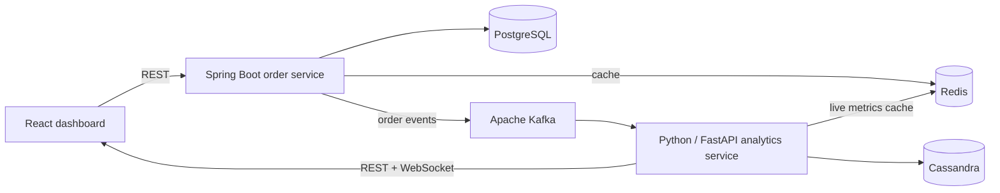

# OPA Platform — Real-Time Order Processing and Analytics

An end-to-end microservices project that processes orders, publishes domain events, persists streaming analytics, and visualizes live operational metrics.

## What the project demonstrates

- Built a microservices-based order processing system with Spring Boot, PostgreSQL, and Python analytics services.
- Implemented Kafka-based streaming analytics, persisting metrics in Cassandra and caching real-time data in Redis.
- Developed a React dashboard for real-time order analytics, revenue trends, and system monitoring.

## Architecture



The Spring Boot service owns transactional order data in PostgreSQL. Each created or updated order emits one event to Kafka. The Python service consumes the event stream, calculates idempotent order, revenue, status, and product metrics, stores durable event and metric snapshots in Cassandra, and maintains low-latency dashboard state in Redis.

## Technology

- Java 17, Spring Boot 3.3, Spring Data JPA, Flyway, Spring Kafka
- PostgreSQL 15, Apache Kafka, Cassandra 4.1, Redis 7
- Python 3.12, FastAPI, kafka-python, DataStax Cassandra driver
- React 18, Material UI, Chart.js
- Docker Compose and GitHub Actions

## Run the complete system

Prerequisites: Docker Desktop with Docker Compose v2, `curl`, and `jq`.

```bash
git clone https://github.com/dbasak763/opaplatform.git
cd opaplatform
./scripts/start-all.sh
```

Endpoints:

| Component | URL |
| --- | --- |
| React dashboard | http://localhost:3000 |
| Order API | http://localhost:8090/api |
| Order health | http://localhost:8090/api/actuator/health |
| Analytics API | http://localhost:8091 |
| Analytics health | http://localhost:8091/health |

Development credentials for the order API are `admin` / `admin123`.

## Prove the end-to-end flow

After the stack is healthy, run:

```bash
./scripts/test-e2e.sh
```

The test creates a real order and verifies:

1. Spring Boot writes the order to PostgreSQL.
2. The order service publishes a Kafka event.
3. The Python analytics service consumes the event.
4. Redis contains the live metric snapshot.
5. Cassandra contains the event and durable metric snapshot.
6. The analytics APIs and React dashboard are reachable.

Stop the system with:

```bash
./scripts/stop-all.sh
```

## Component tests

```bash
./scripts/run-tests.sh
```

CI runs the Spring Boot test suite, Python analytics tests, React production build, and the Docker Compose end-to-end flow on every pull request.

## Project history

Most of the original project work was completed in 2025:

- **August 2025:** Created the core Spring Boot order-processing platform and PostgreSQL data model.
- **October 2025:** Added Kafka event streaming, the Python analytics service, Cassandra/Redis analytics storage, and the React monitoring dashboard.

In **July 2026**, the project was repaired and completed as a reproducible end-to-end system. That maintenance work:

- restored missing Spring Boot application, controller, service, event, and exception-handling code;
- connected order creation and updates to PostgreSQL and Kafka with database migrations and health checks;
- replaced incomplete analytics behavior with a real Kafka consumer that calculates idempotent order and revenue metrics, persists events and metric snapshots in Cassandra, and caches live state in Redis;
- repaired the React dashboard's API integration, revenue trends, live monitoring, and WebSocket lifecycle;
- completed production container builds and a health-checked Docker Compose topology for every service; and
- added component tests and a GitHub Actions end-to-end test that creates an order and verifies the complete PostgreSQL → Kafka → Python → Cassandra/Redis → React flow.

The July 2026 commits are maintenance and completion work; the original feature development remains dated to 2025.
